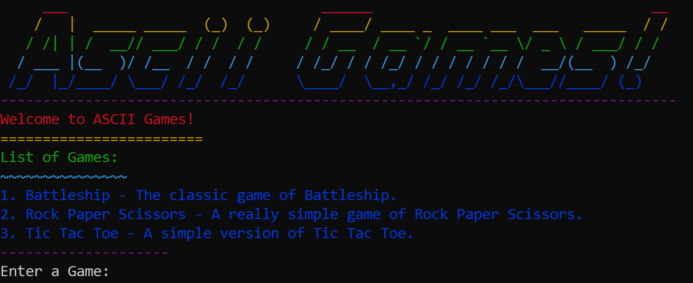

# Asscii Games

## Description
This is a game manager for all of your java ascii games. It is super easy to add games to the manager.

## Inspiration
I wanted a way to easily have asscii games all in one place.

## Current Games
- Battleship - The classic game of Battleship. [@allancoding](https://github.com/allancoding)
- Rock Paper Scissors - A really simple game of Rock Paper Scissors. [@allancoding](https://github.com/allancoding)
- Tic Tac Toe - A simple version of Tick Tack Toe. [@allancoding](https://github.com/allancoding)

## How to play
1. Run the `manager` class.
2. Select a game to play.
3. Play the game and have fun!



## How to add a game
1. Create a new class inside of the games folder.
2. Create nested class inside of the main class name it `Game` 
3. the method `start` should be the main method for the game.
5. You can add a description and name to the game by adding a `description` & `name` variable to the `Game` class.
6. 2 booleans should be passed to the `start` method. The first will be true and the second will be false.
Example:
```java
public class Chess {
    public static class Game {
        public static final String Name = "Chess";
        public static final String Description = "The classic game of Chess.";
        public static void start(boolean, instructions, boolean main) {
            // Game code here
        }
    }
}
```
Note: The methods will need to be static.

## Information about the `ascii` class
The asscii class is used as a helper class for asscii. It has a few methods that can be used to help with the game. Here are the methods:

### `clear` - Clears the screen.

Parameters:
- None

Returns:
- None

### `print` - Prints a string to the screen.

Parameters:
- `String` - The string to print.

Returns:
- None

### `println` - Prints a string to the screen with a new line.

Parameters:
- `String` - The string to print.

Returns:
- None

### `printerror` - Prints an error message to the screen.

Parameters:
- `String` - The error message to print.

Returns:
- None

### `printRepeated` - Prints a string repeated a number of times.

Parameters:
- `String` - The string to print.
- `int` - The number of times to print the string.
- `boolean` - Whether to print a new line at the end.

Returns:
- None

### `wait` - Waits for a number of milliseconds.

Parameters:
- `int` - The number of milliseconds to wait.

Returns:
- None

### `waitForEnter` - Waits for the user to press enter.

Parameters:
- `String` - The message to print before waiting.

Returns:
- None

### `toS` - Converts a char to a string.

Parameters:
- `char` - The char to convert.

Returns:
- `String` - The converted string.

## Dependencies
- [Java](https://www.java.com/) - 8+
- [Janis](https://github.com/fusesource/jansi) - 2.4.1+

## How to contribute
Contributing is super easy. Just add a new game to the games folder and follow the instructions above. Then create a pull request and I will review it.